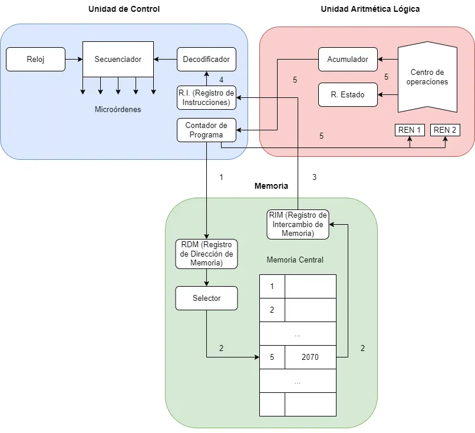
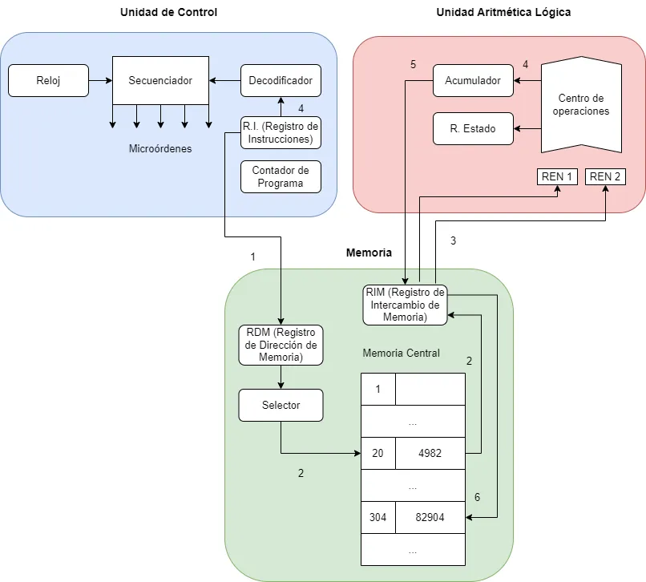

# Ciclo Fetch-Execute

## Fase de Búqueda y Decodificación:

1. Se envía la _dirección de memoria_ de la _instrucción_ del **contador de
   programa** hacia el **RDM**.
2. El **selector** toma la _dirección de memoria_ del **RDM** y busca la
   _instrucción_ (el valor) asociada a esta en la **memoria central** y la envía
   al **RIM**.
3. El **RIM** manda la _instrucción_ al **R.I.**
4. El **R.I.** pasa la _instrucción_ al **decodificador** para "traducirla" de
   manera que la máquina pueda comprenderla.
5. El **secuenciador** incrementa uno el **contador de programa** para repetir
   este proceso al decodificador.

## Fase de Ejecución y Almacenamiento

1. La **unidad de control** accede a su _registro de instrucción_ y manda la
   _dirección de memoria_ del _primer operando_.
2. El **selector** busca la _dirección en memoria_ del _primer operando_ y manda
   su valor al **RIM**.
3. El **RIM** manda el el _valor del primer operando_ al **REN 1**.
   1. Se repiten estos 3 pasos para el _segundo operando_ para finalmente ser
      mandado a **REN 2**.
4. El **secuenciador** envía órdenes al **centro de operaciones** y se guarda el
   _resultado_ en el _acumulador_.
5. El _acumulador_ manda dicho _resultado_ al **RIM**.
6. El **RIM** manda el _resultado_ a la _memoria central_ y, a su vez, el
   **R.I** manda la _dirección_ en dónde se guardará dicho _resultado_.
