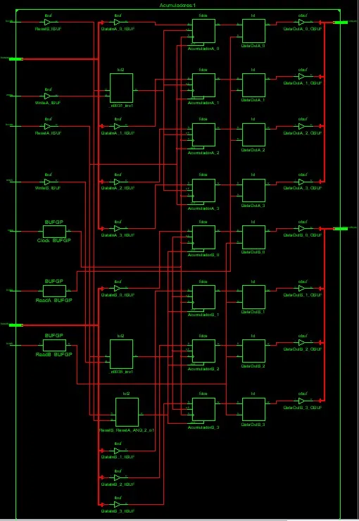

# Registros de Propósito General y Específico

## Contador

### Rtl


### Tech1


### Código

```vhdl
ibrary IEEE;
use IEEE.STD_LOGIC_1164.ALL;
use IEEE.STD_LOGIC_ARITH.ALL;
use IEEE.STD_LOGIC_UNSIGNED.ALL;

entity ContadorPrograma is
    Port (
        Clock : in STD_LOGIC;
        Reset : in STD_LOGIC;
        ProgramCounter : out STD_LOGIC_VECTOR(7 downto 0)
    );
end ContadorPrograma;

architecture Behavioral of ContadorPrograma is
    signal Counter : STD_LOGIC_VECTOR(7 downto 0) := "00000000";  -- Inicializar el contador en 0
begin
    process (Clock, Reset)
    begin
        if Reset = '1' then
            Counter <= "00000000";  -- Reiniciar el contador en 0 en caso de reinicio
        elsif rising_edge(Clock) then
            if Counter = "11111111" then
                Counter <= "00000000";  -- Volver al inicio del contador al llegar al máximo
            else
                Counter <= Counter + 1;  -- Incrementar el contador en 1
            end if;
        end if;
    end process;

    ProgramCounter <= Counter;  -- La salida del contador es el valor actual del contador

end Behavioral;
```

### Simulación


<center>Al reloj se le aplicó un cambio de 0 a 1 cada μs, el tiempo de simulacion total fue de 5 μs</center>

<div style="page-break-after: always;"></div>

## Acumuladores

### Rtl


<div style="page-break-after: always;"></div>

### Tech1



<div style="page-break-after: always;"></div>

### Código

```vhdl
library IEEE;
use IEEE.STD_LOGIC_1164.ALL;
use IEEE.STD_LOGIC_ARITH.ALL;
use IEEE.STD_LOGIC_UNSIGNED.ALL;

entity Acumuladores is
    Port (
        Clock : in STD_LOGIC;
        ResetA, ResetB : in STD_LOGIC;
        DataInA, DataInB : in STD_LOGIC_VECTOR(3 downto 0);
        ReadA, ReadB : in STD_LOGIC;
        WriteA, WriteB : in STD_LOGIC;
        DataOutA, DataOutB : out STD_LOGIC_VECTOR(3 downto 0)
    );
end Acumuladores;

architecture Behavioral of Acumuladores is
    signal AcumuladorA, AcumuladorB : STD_LOGIC_VECTOR(3 downto 0) := "0000";  -- Inicializar los acumuladores en 0
begin
    process (Clock, ResetA, ResetB, ReadA, ReadB, WriteA, WriteB)
    begin
        if ResetA = '1' then
            AcumuladorA <= "0000";  -- Reiniciar el acumulador A en 0 en caso de reinicio
        elsif ResetB = '1' then
            AcumuladorB <= "0000";  -- Reiniciar el acumulador B en 0 en caso de reinicio
        elsif rising_edge(Clock) then
            if WriteA = '1' then
                AcumuladorA <= DataInA;  -- Escribir en el acumulador A si WriteA es activo
            end if;
            if WriteB = '1' then
                AcumuladorB <= DataInB;  -- Escribir en el acumulador B si WriteB es activo
            end if;
        end if;
    end process;

    process (ReadA, ReadB)
    begin
        if ReadA = '1' then
            DataOutA <= AcumuladorA;  -- Leer el acumulador A si ReadA es activo
        end if;
        if ReadB = '1' then
            DataOutB <= AcumuladorB;  -- Leer el acumulador B si ReadB es activo
        end if;
    end process;

end Behavioral;
```

### Simulación


<center>Cabe mencionar que, aqui tanto en read de a y b, write y clock se insertó un clock de 1 μs el tiempo total de la simulacion fue de 5 μs</center>

<div style="page-break-after: always;"></div>

## Registro Índice

### Rtl


<div style="page-break-after: always;"></div>

### Tech1


<div style="page-break-after: always;"></div>

### Código

```vhdl
library IEEE;
use IEEE.STD_LOGIC_1164.ALL;

entity RegistroIndice is
    Port (
        Clock : in STD_LOGIC;
        Reset : in STD_LOGIC;
        DataIn : in STD_LOGIC_VECTOR(7 downto 0);
        EnableWrite : in STD_LOGIC;
        Read : in STD_LOGIC;
        DataOut : out STD_LOGIC_VECTOR(7 downto 0)
    );
end RegistroIndice;

architecture Behavioral of RegistroIndice is
    signal Registro : STD_LOGIC_VECTOR(7 downto 0) := (others => '0');  -- Inicializar el registro en 0
begin
    process (Clock, Reset)
    begin
        if Reset = '1' then
            Registro <= (others => '0');  -- Reiniciar el registro en 0 en caso de reinicio
        elsif rising_edge(Clock) then
            if EnableWrite = '1' then
                Registro <= DataIn;  -- Escribir en el registro si EnableWrite es activo
            end if;
        end if;
    end process;

    process (Read)
    begin
        if Read = '1' then
            DataOut <= Registro;  -- Leer el contenido del registro si Read es activo
        end if;
    end process;

end Behavioral;
```

### Simulación


<div style="page-break-after: always;"></div>

## Registro General Stack

### Rtl


<div style="page-break-after: always;"></div>

### Tech1


<div style="page-break-after: always;"></div>

### Código

```vhdl
library IEEE;
use IEEE.STD_LOGIC_1164.ALL;

entity RegistroStack is
    Port (
        Clock : in STD_LOGIC;
        Reset : in STD_LOGIC;
        DataIn : in STD_LOGIC_VECTOR(7 downto 0);
        Push : in STD_LOGIC;
        Pop : in STD_LOGIC;
        DataOut : out STD_LOGIC_VECTOR(7 downto 0)
    );
end RegistroStack;

architecture Behavioral of RegistroStack is
    type StackType is array (0 to 7) of STD_LOGIC_VECTOR(7 downto 0);
    signal Stack : StackType := (others => (others => '0'));  -- Inicializar la pila en 0
    signal Top : integer range 0 to 7 := 0;  -- Puntero al tope de la pila

begin
    process (Clock, Reset)
    begin
        if Reset = '1' then
            Top <= 0;  -- Reiniciar el puntero de la pila en 0
        elsif rising_edge(Clock) then
            if Push = '1' and Top < 7 then
                Stack(Top + 1) <= DataIn;  -- Empujar (push) un dato en la pila si hay espacio
                Top <= Top + 1;
            elsif Pop = '1' and Top > 0 then
                Top <= Top - 1;  -- Sacar (pop) un dato de la pila si no está vacía
            end if;
        end if;
    end process;

    process
    begin
        DataOut <= Stack(Top);  -- Leer el dato en el tope de la pila
    end process;

end Behavioral;
```

### Simulación

Lamentablemente cada vez que intentabamos correr la simulación la computadora crasheaba