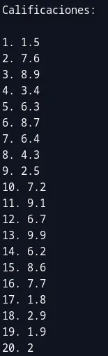

# ADT Listas Estáticas

## Marco Teorico

### Arreglo

Una estructura de datos hace referencia a una colección de elementos y a la
manera en que ésta se almacena en la memoria de la computadora y/o en algún
dispositivo de memoria secundaria. Esta forma de almacenamiento determina la
manera en que los datos se pueden recuperar. En este capítulo se presenta la
estructura de datos tipo arreglo, que se utiliza para guardar información en la
memoria principal.

Un arreglo es una colección finita, ordenada y homogénea de datos. Es finita
porque todo arreglo tiene un tamaño límite, es decir, se define el número máximo
de elementos que puede almacenar. Es ordenada porque permite hacer referencia al
primer elemento, al segundo y así hasta el enésimo elemento que forme el
arreglo. Por último, se dice que es homogénea porque todos los componentes del
arreglo son del mismo tipo de datos.

Un arreglo también se puede ver como una colección lineal de elementos, ya que
cada uno de ellos sólo tiene un predecesor y un sucesor, con excepción del
primero que sólo tiene sucesor y del último, que sólo tiene predecesor. En todo
arreglo se distinguen el nombre, los componentes y los índices. El nombre hace
referencia a la estructura como un todo. Los componentes son los valores que
forman el arreglo, es decir, cada uno de los datos que se almacenan en él.
Mientras que los índices se utilizan para recuperar a cada uno de los
componentes de manera individual.

### La clase Arreglo

La clase Arreglo tiene como atributos la colección de elementos que forman la
estructura de datos y el número actual de elementos, y como métodos el conjunto
de operaciones que son aplicables a un arreglo. La figura 4.3 presenta la clase
Arreglo. En este caso se define como plantilla para lograr mayor generalidad.


<center><strong>Figura 4.3.</strong> Clase Arreglo</center><br>

En la sección privada de la clase se define el arreglo mediante la instrucción:

```cpp
T Datos[MAX];
```

que significa que se tiene una colección de elementos, llamada Datos, que tiene
una capacidad máxima de MAX (constante previamente definida) elementos y que
todos los elementos son del tipo T. Según lo presentado en el capítulo 3, T se
instanciará con el tipo de dato usado al declarar un objeto del tipo Arreglo.
Además, se define el atributo Tam que representa el número actual de elementos
que tiene el arreglo. Al declarar un objeto de este tipo se establece el máximo
número de elementos que puede almacenar, pero el número de valores que
finalmente se guardan depende de la aplicación.

Los métodos de acceso y modificación a los elementos del arreglo se estudiarán
en la siguiente sección, considerando si los elementos del arreglo se encuentran
o no ordenados, ya que esto condiciona la manera de llevar a cabo algunas de las
operaciones sobre los mismos. Para declarar un objeto se utiliza la siguiente
sintaxis:

```cpp
Arreglo<tipo> ObjArreglo;
```

Por ejemplo, para declarar el arreglo Edades

```cpp
Arreglo<int> ObjArreglo;
```

### Referencias

- Guardati S. (2007). ESTRUCTURA DE DATOS ORIENTADA A OBJETOS (1ra ed.).
  Editorial Pearson Educación

<div style="page-break-after: always;"></div>

## Código

### main.cpp

```cpp
/*
- Nombre: Alan Yahir Juárez Rubio
- Actividad 2: ADT - Listas Estáticas
*/

#include "Arreglo.h"
#include "Arreglo.cpp"

#include <locale>
#include <limits>

// Para limpiar pantalla en diferentes SO's
#ifdef _WIN32
#include <cstdlib> // Para Windows
#else
#include <unistd.h> // Para sistemas basados en Unix/Linux
#endif

short int menu();
void limpiarPantalla();
void pausarPantalla();
void opcInvalida();
int ingresarTamanio();
bool errorNumero();

int main() {
	setlocale(LC_CTYPE, "Spanish");
	limpiarPantalla();

	short int opc;
	bool datosIngresados = 0;
	Arreglo<float> calificaciones(MAX);

	do {
		opc = menu();

		switch (opc) {
			case 1:
				calificaciones.Escribir();
				datosIngresados = 1; // Option to input grades
				break;

			case 2:
			case 3:
			case 4:
			case 5:
			case 6:
				if(datosIngresados) {
					switch (opc){
						case 2:
							cout << "Calificaciones:\n\n";
							calificaciones.Leer(); // Option to print grades
							break;

						case 3:
							cout << "Calificación más alta: " << calificaciones.BuscaMayor() << endl;
							break;

						case 4:
							cout << "Calificación más baja: " << calificaciones.BuscaMenor() << endl;
							break;

						case 5:
							calificaciones.ImprimirTotalMenor(6);
							break;

						case 6:
							calificaciones.ImprimirTotalMayor(8.5);
							break;
					}
				} else {
					cout << "Error: No se han ingresado calificaciones" << endl;
				}
				break;

			case 7:
				cout << "¡Adiós, bonito día! ¡Vuelve pronto!\n\n"
					<< "Presiona <enter> para salir";
				break;

			default: opcInvalida(); break;
}

		if (opc != 7) {
			pausarPantalla();
			limpiarPantalla();
		}

	} while (opc != 7);

	return 0;
}

short int menu() {
	short int opc = 0;
	bool error = 0;

	do {
		cout << "MENÚ – SISTEMA DE CALIFICACIONES\n\n"
			<< "1. Ingresar las calificaciones\n"
			<< "2. Imprimir las calificaciones\n"
			<< "3. Mostrar calificación más alta\n"
			<< "4. Mostrar calificación más baja\n"
			<< "5. Imprimir total de calificaciones menores a 6\n"
			<< "6. Imprimir total de calificaciones mayores a 8.5\n"
			<< "7. Salir\n\n"
			<< "Digite una opción: ";
		cin >> opc;

		error = errorNumero();

		pausarPantalla();
		limpiarPantalla();

	} while (error);

	return opc;
}

void limpiarPantalla() { system("clear || cls"); }

void pausarPantalla() {
	cout << "\n\nPresiona <enter> para continuar.";
    cin.ignore(numeric_limits<streamsize>::max(), '\n'); // Limpiar el búfer de entrada después de cada opción
    cin.get();
}

void opcInvalida() { cout << "Opción inválida. Inténtalo de nuevo."; }

bool errorNumero() {
	bool error = 0;

	if(cin.fail()) {
		error = 1;
		// Si la entrada no es un número entero válido
		cin.clear(); // Restablecer el estado de error
		cin.ignore(numeric_limits<streamsize>::max(), '\n'); // Limpiar el búfer de entrada
		cout << "\nError: Ingrese un número válido.\n";
	}

	return error;
}
```

<div style="page-break-after: always;"></div>

### Arreglo.h

```cpp
/*
- Nombre: Alan Yahir Juárez Rubio
- Actividad 2: ADT - Listas Estáticas
*/

#ifndef ARREGLO_H
#define ARREGLO_H

#define MAX 80

#include <iostream>

using namespace std;

template <class T>
class Arreglo {
	private:
		T Datos[MAX];
		int Tam;

	public:
		Arreglo(int);
		void Escribir();
		void Leer();
		T BuscaMayor() const;
		T BuscaMenor() const;
		int ImprimirTotalMenor(T limite) const;
		int ImprimirTotalMayor(T limite) const;
};

#endif
```

<div style="page-break-after: always;"></div>

### Arreglo.cpp

```cpp
/*
- Nombre: Alan Yahir Juárez Rubio
- Actividad 2: ADT - Listas Estáticas
*/

#include "Arreglo.h"

template <class T>
Arreglo<T>::Arreglo(int Valor) {
	Tam = Valor;
}

template <class T>
void Arreglo<T>::Escribir() {
	int Indice;
	do {
		cout << "Ingrese el total de elementos : ";
		cin >> Tam;
	} while (Tam < 1 || Tam > MAX);

	cout << "\nIngrese los datos:\n\n";

	for (Indice = 0; Indice < Tam; Indice++) {
		cout << Indice  + 1 << ": ";
		cin >> Datos[Indice];
	}
}

template <class T>
void Arreglo<T>::Leer() {
	int Indice;
	for (Indice = 0; Indice < Tam; Indice++)
		cout << Indice + 1 << ". " << Datos[Indice] << endl;
}

template <class T>
T Arreglo<T>::BuscaMayor() const {
    T mayor = Datos[0];
    for (int i = 1; i < Tam; i++) {
        if (Datos[i] > mayor) {
            mayor = Datos[i];
        }
    }
    return mayor;
}

template <class T>
T Arreglo<T>::BuscaMenor() const {
    T menor = Datos[0];
    for (int i = 1; i < Tam; i++) {
        if (Datos[i] < menor) {
            menor = Datos[i];
        }
    }
    return menor;
}

template <class T>
int Arreglo<T>::ImprimirTotalMenor(T limite) const {
    int total = 0;
    for (int i = 0; i < Tam; i++) {
        if (Datos[i] < limite) {
            total++;
        }
    }
    cout << "Total de calificaciones menores a " << limite << ": " << total << endl;
    return total;
}

template <class T>
int Arreglo<T>::ImprimirTotalMayor(T limite) const {
    int total = 0;
    for (int i = 0; i < Tam; i++) {
        if (Datos[i] > limite) {
            total++;
        }
    }
    cout << "Total de calificaciones mayores a " << limite << ": " << total << endl;
    return total;
}
```

<div style="page-break-after: always;"></div>

## Corrida del Programa


<center><strong>Menú:</strong> Sistema de Calificaciones</center>


<center><strong>Opción 1:</strong> Ingresar calificaciones</center>



<center><strong>Opción 2:</strong> Imprimir las calificaciones</center>


<center><strong>Opción:</strong> Mostrar la calificación más alta</center>


<center><strong>Opción:</strong> Mostrar la calificación más baja</center>


<center><strong>Opción:</strong> Imprimir el total de calificaciones menores a 6</center>


<center><strong>Opción:</strong> Imprimir total de calificaciones mayores a 8.5</center>
