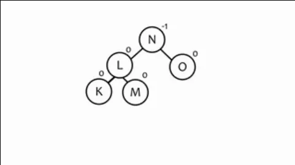

# Marco Teórico

## Árbol

### Qué es un árbol

Un **árbol** consiste en una **agrupación de nodos**, el cuál parte de un **nodo
raíz** y se desgloza jerarquicamente en más nodos.


Cuando el orden de los _nodos_ importa, entonces forman una lista y se le
denomina **árbol ordenado**

En _informática_ los **arboles** son _estructuras de datos no lineales_. Cada
uno de sus _nodos_ guarda información de sí mismo y, a su vez, guarda la
_dirección_ de cada uno de los _nodos_ que le suceden (_nodos hijos_).

### Caracteristicas de un nodo

- **Brazo:** Conexión entre un nodo y otro
- **Altura:** Longitud del camino más largo que comienza en el nodo y termina en
  una hoja. Se dice que la _altura_ del _nodo raíz_ es la _altura del árbol_
- **Nivel o profundidad:** Longitud del camino (único) que comienza en la raíz
  (como nivel 0) y termina en dicho nodo.

### Partes de un árbol (tipos de nodos)

Un **árbol** es una _agrupación de nodos_ ordenados jerarquicamente. Estos nodos
se catalogan de la siguiente manera:

- **Raíz:** Nodo del cuál se desprenden todos los demás nodos.
- **Padre:** Nodo que engloba a dicho nodo.
- **Hijo:** Nodo que se desprende un _nodo padre_. Todos los nodos son nodos
  hijos a excepción del nodo raíz.
- **Ancestro:** Nodo que engloba al padre de dicho nodo.
- **Nieto:** Nodo que se desprende del _padre_ del **nodo padre**, es decir, del
  _ancestro_
- **Hermanos:** Aquellos que tienen un nodo padre en común
- **Terminal, hoja o externo:** Aquellos que no tiene hijos y, por lo tanto,
  marcan el final del árbol. En caso contrario se le denomina **nodo interno**
- **Internos o rama:** Todos aquellos que son nodos padres o, dicho de otra
  manera, todos a quellos que no son terminales. En este tipo se excluye el nodo
  raíz.

### Recorridos

El **recorrido** de un **arbol** es el proceso de visitar de una manera
sistemática, exactamente una vez, cada nodo de un árbol. Los recorridos más
comunes son:

- **Preorden:** raíz, izq, der
- **Inorden:** izq, raíz, der
- **Posorden:** izq, der, raíz

### Tipos de árboles


- **Libres:** Aquellos que se desconoce o no existe un **nodo raíz**
- **Degenerado:** Todos sus nodos tienen como máximo un hijo
- **M-nario:** Cada uno de sus nodos tiene como máximo $m$ hijos
  - **Completo:** Sus nodos tienen o $m$ hijos o ningun hijo
    - **Lleno:** Todos sus nodos terminales llegan a un mismo nivel

## Árbol AVL

Un **árbol AVL** es un _arbol binario de búsqueda_ en el que, para todos los
nodos, la diferencia entre _altura de la **rama izq**_ y la _altura de la **rama
der**_ es menor o igual a 1

#### Conversión a Árbol AVL

Cuando en un **árbol AVL** se le inserta un **nodo**, este puede _perder el
equilibrio_, es decir, dejar de ser un **AVL**.

Para convertir un **arbol binario** a uno **árbol AVL** se tienen que aplicar
rotaciones en sus _subárboles_ que no cumplen la _condición AVL_

> [!NOTE]
>
> - **Nodo conflictivo:** Aquel que no cumple la _condición AVL_
> - **Nodo responsable:** Nodo que que provoca al _nodo conflictivo_.

- **Rotación simple:** El **nodo conflictivo** rota sobre el **hijo
  responsable** del conflicto.
  - **Con hijo:** El _nodo hijo del nodo responsable_ pasa a ser _hijo_ del
    **nodo conflictivo**
    - **Izq - Izq:** Pasa a ser _hijo izquiedo_
    - **Der - der:** Pasa a ser _hijo derecho_


<center>Rotación izquierda</center>




<center>Rotación derecha</center>


<center>Rotación a la derecha con hijo</center>

La **rotación doble** se utiliza cuando el camino hacia el _nodo conflictivo_
hace zigzag, es decir, el _hijo_ va hacia una dirección mientras el _nieto_
(nodo conflictivo) va hacia otra dirección (izq-der o der-izq).

- **Rotación doble:** El _hijo_ rota sobre el _nieto_ (rotación simple)
  - El _nodo conflictivo_ rota sobre el _nuevo hijo_.


<center>Rotación Izquierda-Derecha</center>


<center>Rotación Derecha-Izquerda</center>

<div style="page-break-after: always;"></div>

### Referencias

- [Orduz, S.](https://platzi.com/profesores/sergio-orduz-240/) (s.f.).
  _Árboles_.
  [Curso de Matemáticas Discretas](https://platzi.com/cursos/discretas/).
  [Platzi](https://platzi.com/). Consultado el 26 de noviembre de 2023 de
  https://platzi.com/clases/1319-discretas/12229-arboles/

- [Orduz, S.](https://platzi.com/profesores/sergio-orduz-240/) (s.f.). _Sub
  árboles, vértices, y notación_.
  [Curso de Matemáticas Discretas](https://platzi.com/cursos/discretas/).
  [Platzi](https://platzi.com/). Consultado el 26 de noviembre de 2023 de
  https://platzi.com/clases/1319-discretas/12230-sub-arboles-vertices-y-notacion/

- Departamento de Informática - Universidad de Valladolid. (septiembre 10,
  2011). _Tema 4: Árboles_.Consultado el 26 de noviembre de 2023 de
  https://www.infor.uva.es/~cvaca/asigs/doceda/tema4.pdf

- Wikipedia (s.f.). _Árbol AVU_.Consultado el 26 de noviembre de 2023 de
  https://es.wikipedia.org/wiki/%C3%81rbol_AVL#

- Estrategias de Programación y Estructuras de Datos (marzo 28, 2020). _Tema 7
  (1/1): Árboles Binarios de Búsqueda y Árboles AVL_. Consultado el 26 de
  noviembre de 2023 de https://www.youtube.com/watch?v=RXIpsIa_SCY

<div style="page-break-after: always;"></div>

## Código

### main.cpp

```cpp
/*
Nombre: Alan Yahir Juárez Rubio
Actividad 6: Árbol AVL
*/
#include <iostream>
#include "ArbolAVL.h"
#include "ArbolAVL.cpp"

int main() {
    ArbolAVL<int> arbol;

    // Insertar elementos en el árbol AVL.
    arbol.insertar(10);
    arbol.insertar(20);
    arbol.insertar(30);
    arbol.insertar(15);
    arbol.insertar(5);

    // Mostrar el árbol antes de las rotaciones.
    std::cout << "Árbol AVL antes de las rotaciones:" << std::endl;
    arbol.recorridoInOrder();

    // Insertar un elemento que requiere una rotación.
    arbol.insertar(25);

    // Mostrar el árbol después de las rotaciones.
    std::cout << "\nÁrbol AVL después de la inserción y rotaciones:" << std::endl;
    arbol.recorridoInOrder();

    return 0;
}

```

<div style="page-break-after: always;"></div>

### ArbolAVL.h

```cpp
/*
Nombre: Alan Yahir Juárez Rubio
Actividad 6: Árbol AVL
*/
#ifndef ARBOLAVL_H
#define ARBOLAVL_H

template <typename T>
class NodoAVL {
public:
    T dato;
    NodoAVL* izquierda;
    NodoAVL* derecha;
    int altura;

    NodoAVL(const T& valor) : dato(valor), izquierda(nullptr), derecha(nullptr), altura(1) {}
};

template <typename T>
class ArbolAVL {
private:
    NodoAVL<T>* raiz;

    int altura(NodoAVL<T>* nodo);
    int balance(NodoAVL<T>* nodo);
    NodoAVL<T>* rotacionDerecha(NodoAVL<T>* y);
    NodoAVL<T>* rotacionIzquierda(NodoAVL<T>* x);
    NodoAVL<T>* insertar(NodoAVL<T>* nodo, const T& valor);

public:
    ArbolAVL() : raiz(nullptr) {}
    ~ArbolAVL();

    void insertar(const T& valor);
	void recorridoInOrderAux(NodoAVL<T>* nodo);
	void recorridoInOrder();    // Puedes agregar más funciones según tus necesidades, como eliminar, buscar, recorrer, etc.
};

#endif

```

<div style="page-break-after: always;"></div>

### ArbolAVL.cpp

```cpp
/*
Nombre: Alan Yahir Juárez Rubio
Actividad 6: Árbol AVL
*/
#include "ArbolAVL.h"
#include <algorithm>
#include <iostream>

using namespace std;

template <typename T>
int ArbolAVL<T>::altura(NodoAVL<T>* nodo) {
    if (nodo == nullptr) {
        return 0;
    }
    return nodo->altura;
}

template <typename T>
int ArbolAVL<T>::balance(NodoAVL<T>* nodo) {
    if (nodo == nullptr) {
        return 0;
    }
    return altura(nodo->izquierda) - altura(nodo->derecha);
}

template <typename T>
NodoAVL<T>* ArbolAVL<T>::rotacionDerecha(NodoAVL<T>* y) {
    NodoAVL<T>* x = y->izquierda;
    NodoAVL<T>* T2 = x->derecha;

    x->derecha = y;
    y->izquierda = T2;

    y->altura = std::max(altura(y->izquierda), altura(y->derecha)) + 1;
    x->altura = std::max(altura(x->izquierda), altura(x->derecha)) + 1;

    return x;
}

template <typename T>
NodoAVL<T>* ArbolAVL<T>::rotacionIzquierda(NodoAVL<T>* x) {
    NodoAVL<T>* y = x->derecha;
    NodoAVL<T>* T2 = y->izquierda;

    y->izquierda = x;
    x->derecha = T2;

    x->altura = std::max(altura(x->izquierda), altura(x->derecha)) + 1;
    y->altura = std::max(altura(y->izquierda), altura(y->derecha)) + 1;

    return y;
}

template <typename T>
NodoAVL<T>* ArbolAVL<T>::insertar(NodoAVL<T>* nodo, const T& valor) {
    // Implementa la inserción normal de un árbol binario de búsqueda.
    if (nodo == nullptr) {
        return new NodoAVL<T>(valor);
    }

    if (valor < nodo->dato) {
        nodo->izquierda = insertar(nodo->izquierda, valor);
    } else if (valor > nodo->dato) {
        nodo->derecha = insertar(nodo->derecha, valor);
    } else {
        // No permitir duplicados (puedes manejarlo de otra manera si lo deseas).
        return nodo;
    }

    // Actualizar la altura de este nodo.
    nodo->altura = 1 + std::max(altura(nodo->izquierda), altura(nodo->derecha));

    // Obtener el factor de equilibrio de este nodo.
    int factorEquilibrio = balance(nodo);

    // Casos de rotación.
    // Rotación simple a la derecha.
    if (factorEquilibrio > 1 && valor < nodo->izquierda->dato) {
        return rotacionDerecha(nodo);
    }
    // Rotación simple a la izquierda.
    if (factorEquilibrio < -1 && valor > nodo->derecha->dato) {
        return rotacionIzquierda(nodo);
    }
    // Rotación doble a la izquierda-derecha.
    if (factorEquilibrio > 1 && valor > nodo->izquierda->dato) {
        nodo->izquierda = rotacionIzquierda(nodo->izquierda);
        return rotacionDerecha(nodo);
    }
    // Rotación doble a la derecha-izquierda.
    if (factorEquilibrio < -1 && valor < nodo->derecha->dato) {
        nodo->derecha = rotacionDerecha(nodo->derecha);
        return rotacionIzquierda(nodo);
    }

    return nodo;
}

template <typename T>
void ArbolAVL<T>::insertar(const T& valor) {
    raiz = insertar(raiz, valor);
}

// Implementa la función destructora para liberar la memoria.
template <typename T>
ArbolAVL<T>::~ArbolAVL() {
    // Puedes implementar la liberación de la memoria aquí.
    // Por ejemplo, utilizando un recorrido postorden para eliminar los nodos.
}

template <typename T>
void  ArbolAVL<T>::recorridoInOrderAux(NodoAVL<T>* nodo) {
    if (nodo != nullptr) {
        recorridoInOrderAux(nodo->izquierda);
        std::cout << nodo->dato << " ";
        recorridoInOrderAux(nodo->derecha);
    }
}

template <typename T>
void  ArbolAVL<T>::ArbolAVL::recorridoInOrder() {
    recorridoInOrderAux(raiz);
    std::cout << std::endl;
}
```

<div style="page-break-after: always;"></div>

## Imagen de la corrida


