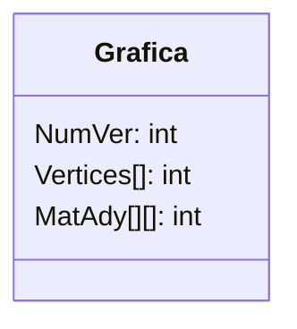
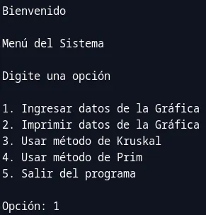
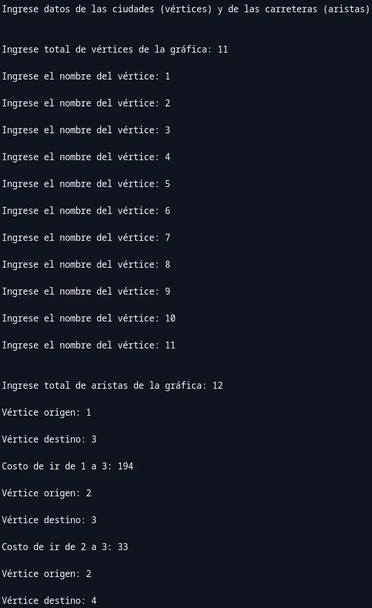
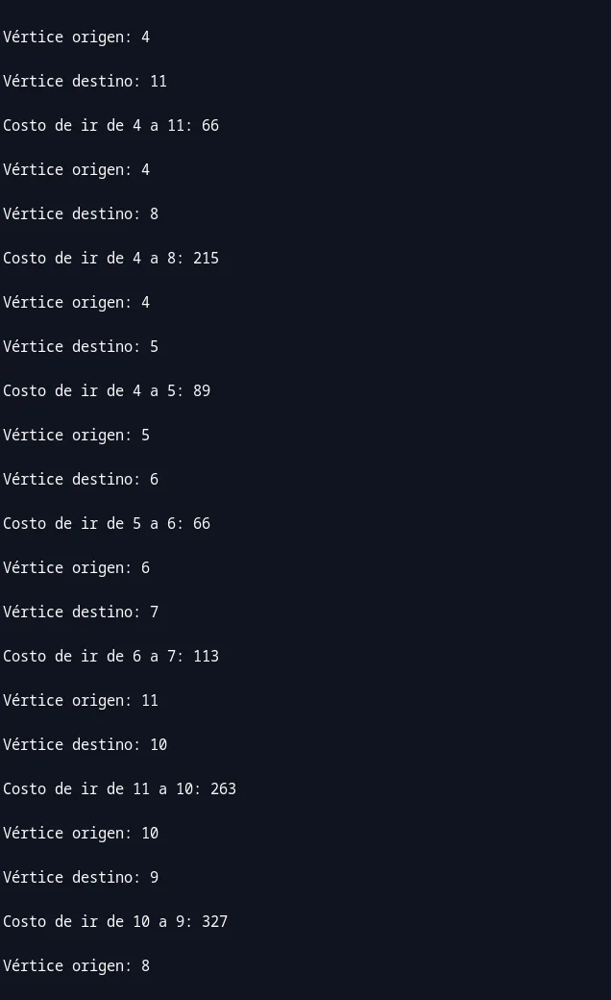
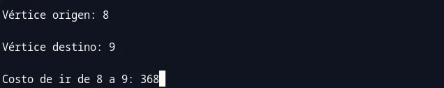
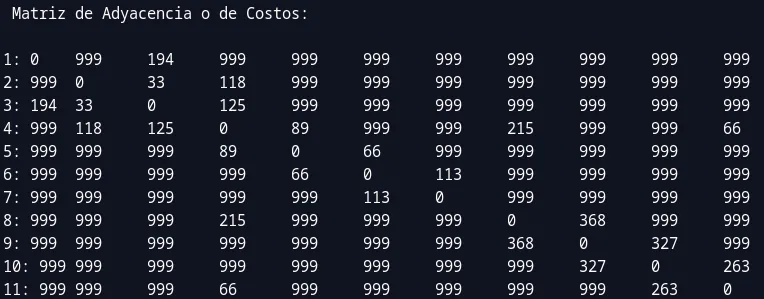
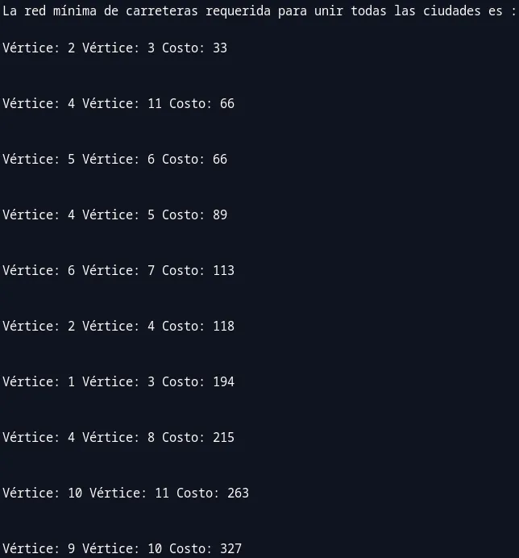
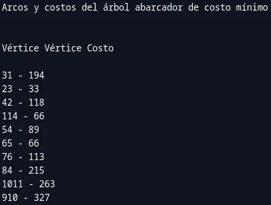

# Gráficas o Grafos no Dirigidos

## Marco Teorico

### Gráficas no dirigidas

Una **gráfica no dirigida** o **gráfica** se caracteriza porque sus aristas son
pares no ordenados de vértices. Por lo tanto, si existe una arista o arco de
$V_1$ a $V_2$, ésta será la misma que de $V_2$ a $V_1$, se grafica sin flecha al
final y se expresa como:

$$a = (V_1, V_2) = (V_2, V_1)$$

Debido a esta característica, las gráficas son muy útiles cuando se tienen datos
y relaciones **simétricas** entre ellos.

#### Representación de una gráfica

Este tipo de gráficas, igual que las digráficas, se representan por medio de una
**matriz**. Si las aristas tienen asociado un costo o distancia, la matriz
recibe el nombre de **matriz de adyacencia etiquetada** o matriz de distancias o
costos.

Como se menciono anteriormente, las gráficas representan relaciones simetricas
y, por lo tanto, la matriz de adyacencia resulta una matriz simétrica.

#### La clase gráfica no dirigida

Se define la clase Grafica para representar este tipo de estructura de datos.
Considerando que se usa una matriz de adyacencia para almacenar la información
relacionada con la gráfica. Los atributos son el número de vértices y sus
nombres y la matriz de adyacencias. Los métodos se presentan y explican en la
siguiente sección.



#### Recorrido de gráficas no dirigidas

Las operaciones que se aplican sobre una gráfica están orientadas a encontrar
los _caminos de costos mínimos_ entre sus vértices. Antes de presentar estos
métodos, resulta necesario explicar algunos conceptos.

**Árbol libre** es una gráfica conexa acíclica. **Árbol abarcador** es un árbol
libre que conecta todos los vértices de la gráfica. El costo del árbol se
calcula como la suma de los costos de las aristas. Por lo tanto, un árbol
abarcador de costo mínimo es el formado por las aristas de menor costo.

##### Método de Prim

Este método encuentra el árbol abarcador de costo mínimo de una gráfica. Trabaja
con _dos conjuntos de vértices_, uno de los cuales es `Vertices` (el conjunto de
todos los vértices de G) y el otro es `VerAux` (que es un subconjunto de
Vertices). Inicialmente `VerAux` tiene asignado el valor del primer índice. Los
pasos principales de este método son:

1. Buscar la arista (`ver1`, `ver2`) de costo mínimo de tal forma que conecte a
   `VerAux` con la subgráfica correspondiente a `(Vertices – VerAux`).

2. Agregar el vértice `ver2` al conjunto `VerAux`.

3. Repetir los pasos 1 y 2 hasta que se alcance la condición
   (`VerAux = Vertices`).

##### Método de Kruskal

Este método, lo mismo que el de Prim, genera el _árbol abarcador de costo
mínimo_ de una gráfica. Básicamente consiste en seleccionar las _aristas de
menor costo_ y formar el árbol con sus vértices. Los pasos principales de este
método son:

1. Generar una partición del conjunto de vértices. Inicialmente la partición es
   de longitud uno (una por cada vértice): `Partic= {{1}, {2},..., {NumVer}}`.

2. Seleccionar la arista de menor costo. Si ésta une vértices que se encuentran
   en particiones distintas, éstas se reemplazan por su unión.

3. Repetir el paso 2 hasta que el conjunto de particiones quede formado por una
   sola partición igual al conjunto de vértices:
   `Partic= {1, 2,..., NumVer} = Vertices`.

### Referencias

- Guardati S. (2007). ESTRUCTURA DE DATOS ORIENTADA A OBJETOS (1ra ed.).
  Editorial Pearson Educación

<div style="page-break-after: always;"></div>

## Código

### main.cpp

```cpp
/*
Nombre: Alan Yahir Juárez Rubio
Actividad 7: Gráficas o Grafos no Dirigidos
*/
// Aplicación del concepto de gráficas para encontrar el conjunto mínimo de carreteras, con el menor costo asociado, que una un grupo de ciudades.
#include "Grafica.h"
#include "Grafica.cpp"

#include <locale>
#include <limits>

// Para limpiar pantalla en diferentes SO's
#ifdef _WIN32
#include <cstdlib> // Para Windows
#else
#include <unistd.h> // Para sistemas basados en Unix/Linux
#endif

short int menu();
void limpiarPantalla();
void pausarPantalla();
void opcInvalida();
bool errorNumero();

int main() {
	setlocale(LC_CTYPE, "Spanish");
	limpiarPantalla();

	short int opc;
	Grafica<int> Caminos;
	bool datosIngresados = 0;

	do {
		opc = menu();

		switch (opc) {
			case 1:
				cout << "Ingrese datos de las ciudades (vértices) y de las carreteras (aristas)\n";
				Caminos.Lee();
				datosIngresados = 1;
				break;

			cout << "Datos Ingresados: " << datosIngresados << endl;

			case 2:
			case 3:
			case 4:
				if (datosIngresados) {
					switch (opc) {
						case 2: Caminos.Imprime(); break;

						case 3:
							cout << "La red mínima de carreteras requerida para unir todas las ciudades es :\n";
							Caminos.Kruskal();
							break;

						case 4: Caminos.Prim(); break;
					}
				} else {
					cout << "Error: No se han introducido datos.";
				}
				break;

			case 5:
				cout << "Adiós, !bonito día! !Vuelve pronto!\n\n"
					<< "Presiona <enter> para salir";
				break;

			default: opcInvalida(); break;
		}

		if (opc != 5) {
			pausarPantalla();
			limpiarPantalla();
		}

	} while (opc != 5);

	return 0;
}

short int menu() {
	short int opc = 0;
	bool error = 0;

	do {
		cout << "Bienvenido\n\n"
			<<	"Menú del Sistema\n\n"
			<< "Digite una opción\n\n"
			<< "1. Ingresar datos de la Gráfica\n"
			<< "2. Imprimir datos de la Gráfica\n"
			<< "3. Usar método de Kruskal\n"
			<< "4. Usar método de Prim\n"
			<< "5. Salir del programa\n\n"
			<< "Opción: ";
		cin >> opc;

		error = errorNumero();

		pausarPantalla();
		limpiarPantalla();

	} while (error);

	return opc;
}

void limpiarPantalla() { system("clear || cls"); }

void pausarPantalla() {
	cout << "\n\nPresiona <enter> para continuar.";
    cin.ignore(numeric_limits<streamsize>::max(), '\n'); // Limpiar el búfer de entrada después de cada opción
    cin.get();
}

void opcInvalida() { cout << "Opción inválida. Inténtelo de nuevo."; }

bool errorNumero() {
	bool error = 0;

	if(cin.fail()) {
		error = 1;
		// Si la entrada no es un número entero válido
		cin.clear(); // Restablecer el estado de error
		cin.ignore(numeric_limits<streamsize>::max(), '\n'); // Limpiar el búfer de entrada
		cout << "\nError: Ingrese un número válido.\n";
	}

	return error;
}

/*
Capturar y probar el programa 8.3 (le falta la función imprime la cual se puede reutilizar de la pág. 415) y programa 8.4 (le falta un menú) con los datos de la figura 8.16 y la tabla 8.11. Del libro de Estructura de Datos Orientada a Objetos Algoritmos con C++ de laAutora: Silvia Guardati
*/
```

<div style="page-break-after: always;"></div>

### Grafica.h

```cpp
/*
Nombre: Alan Yahir Juárez Rubio
Actividad 7: Gráficas o Grafos no Dirigidos
*/
#ifndef GRAFICA_H
#define GRAFICA_H

#include <iostream>
#include <string>

using namespace std;

// Máximo número de vértices que maneja la clase Gráfica.
#define MAX 20

// Función auxiliar que obtiene el valor más pequeño de dos dados como parámetros. La utiliza el método de Kruskal.
inline int Minimo(int Val1, int Val2) {
	int Min = Val1;
	if (Val2 < Min) { Min = Val2; }
	return Min;
}

// Función auxiliar que obtiene el valor más grande de dos dados como parámetros. La utiliza el método de Kruskal.
inline int Maximo(int Val1, int Val2) {
	int Max = Val1;
	if (Val2 > Max) { Max = Val2; }
	return Max;
}

// Definición de la plantilla de la clase Grafica. Se incluyen como atributos la matriz de adyacencia (MatAdy), el total de vértices (NumVer) y sus nombres (Vertices).
template <class T>
class Grafica {
	private:
		T MatAdy[MAX][MAX];
		int NumVer, Vertices[MAX];

	public:
		Grafica();
		void Lee();
		void Imprime();
		// Métodos que calculan el árbol abarcador de costo mínimo.
		void Prim();
		void Kruskal();
};

#endif
```

<div style="page-break-after: always;"></div>

### Grafica.cpp

```cpp
/*
Nombre: Alan Yahir Juárez Rubio
Actividad 7: Gráficas o Grafos no Dirigidos
*/
#include "Grafica.h"

// Declaración del método constructor. Inicializa el número de vértices en cero y la matriz de distancias con un valor arbitrario muy grande (999), excepto en la diagonal principal, donde el costo es cero.
template <class T>
Grafica<T>::Grafica() {
	for (int Ind1 = 0; Ind1 < MAX; Ind1++) {
		for (int Ind2 = 0; Ind2 < MAX; Ind2++) {
			if (Ind1 != Ind2) {
				MatAdy[Ind1][Ind2] = 999;
			} else {
				MatAdy[Ind1][Ind2] = 0;
			}
		}
	}

	NumVer = 0;
}

// Método que lee del teclado la información de la gráfica. En esta solución el nombre de los vértices sólo pueden ser valores enteros.
template <class T>
void Grafica<T>::Lee() {
	int Aristas, Costo, Ind1, Origen, Destino;

	cout << "\n\nIngrese total de vértices de la gráfica: ";
	cin >> NumVer;

	for (Ind1 = 0; Ind1 < NumVer; Ind1++) {
		cout << "\nIngrese el nombre del vértice: ";
		cin >> Vertices[Ind1];
	}

	cout << "\n\nIngrese total de aristas de la gráfica: ";
	cin >> Aristas;

	for (Ind1 = 0; Ind1 < Aristas; Ind1++) {
		cout << "\nVértice origen: ";
		cin >> Origen;

		cout << "\nVértice destino: ";
		cin >> Destino;

		cout << "\nCosto de ir de " << Origen << " a " << Destino << ": ";
		cin >> Costo;

		MatAdy[Origen - 1][Destino - 1] = Costo;
		MatAdy[Destino - 1][Origen - 1] = Costo;
	}
}

template <class T>
void Grafica<T>::Imprime() {
	int Ind1, Ind2;
	// Impresión de la matriz de adyacencia o de costos.
	cout << "\n\n Matriz de Adyacencia o de Costos: \n\n";

	for (Ind1 = 0; Ind1 < NumVer; Ind1++) {
		cout << Vertices[Ind1] << ": ";
		for (Ind2 = 0; Ind2 < NumVer; Ind2++) {
			cout << MatAdy[Ind1][Ind2] << "\t";
		}
		cout << endl;
	}

	cout << endl;
}

/* Este método encuentra el árbol abarcador de costo mínimo de una gráfica. En el arreglo VerAux se almacenan los vértices con menor costo que van formando el árbol abarcador. */
template <class T>
void Grafica<T>::Prim() {
	int MCosto[MAX], VerAux[MAX], Ind1, Ind2, VerMen, MenCos;

	/* Inicializa el subconjunto de vértices VerAux con el valor del primer vértice. */
	for (Ind1 = 0; Ind1 < NumVer; Ind1++) {
		MCosto[Ind1] = MatAdy[0][Ind1];
		VerAux[Ind1] = 0;
	}

	cout << "\n\n\nArcos y costos del árbol abarcador de costo mínimo\n\n";
	cout << "\nVértice Vértice Costo \n";

	/* Encuentra el vértice VerMen en (Vertices - VerAux) tal que el costo de ir de dicho vértice a uno de VerAux sea mínimo. */
	for (Ind1 = 0; Ind1 < NumVer - 1; Ind1++) {
		MenCos = MCosto[1];
		VerMen = 1;

		for (Ind2 = 2; Ind2 < NumVer; Ind2++) {
			if (MCosto[Ind2] < MenCos) {
				MenCos = MCosto[Ind2];
				VerMen = Ind2;
			}
		}

		cout << "\n" << Vertices[VerMen] << Vertices[VerAux[VerMen]] << " - " << MatAdy[VerMen][VerAux[VerMen]];

		/* Se agrega el vértice VerMen a VerAux y se redefinen los costos asociados. */
		MCosto[VerMen] = 1000;

		for (Ind2 = 1; Ind2 < NumVer; Ind2++) {
			if ((MatAdy[VerMen][Ind2] < MCosto[Ind2]) && MCosto[Ind2] < 1000) {
				MCosto[Ind2] = MatAdy[VerMen][Ind2];
				VerAux[Ind2] = VerMen;
			}
		}
	}

	cout << "\n\n";
}

template <class T>
void Grafica<T>::Kruskal() {
	/* El arreglo auxiliar ArisCosto[][] almacena en cada renglón los datos de una arista: vértices adyacentes y costo. El arreglo Partic[] almacena particiones de Vertices. Inicialmente Partic = {{1},{2},...,{NumVer}}.*/
	int ArisCosto[2 * MAX][3], Partic[MAX], Ind1, Ind2, Ver1, Ver2, TotAris, Menor, Mayor, Band;

	/* Inicializa Partic[]. */
	for (Ind1 = 0; Ind1 < NumVer; Ind1++) {
		Partic[Ind1] = Ind1;
	}

	/* Inicializa ArisCosto[][]. */
	Ver1 = 0;
	Ver2 = 0;
	TotAris = 0;

	for (Ind1 = 0; Ind1 < NumVer; Ind1++) {
		for (Ind2 = Ind1; Ind2 < NumVer; Ind2++) {
			if (MatAdy[Ind1][Ind2] != 0 && MatAdy[Ind1][Ind2] != 999) {
				ArisCosto[Ver1][Ver2++] = Ind1;
				ArisCosto[Ver1][Ver2++] = Ind2;
				ArisCosto[Ver1++][Ver2] = MatAdy[Ind1][Ind2];
				Ver2 = 0;
				TotAris++;
			}
		}
	}

	/* Ciclo en el cual se seleccionan aristas y se agregan los vértices mientras existan vértices en Partic que se encuentren en distintas particiones. */
	Band = 0;
	while (Band != 1) {
		/* Se selecciona la arista de menor costo. */
		Menor = 999;
		for (Ind1 = 0; Ind1 < TotAris; Ind1++) {
			if (ArisCosto[Ind1][2] < Menor) {
				Ver1 = ArisCosto[Ind1][0];
				Ver2 = ArisCosto[Ind1][1];
				Menor = ArisCosto[Ind1][2];
				Ind2 = Ind1;
			}
		}

		/* Se elimina la arista de menor costo de la matriz ArisCosto. */
		ArisCosto[Ind2][2] = 999;

		/* Se verifica que la arista (Ver1, Ver2) una dos vértices que pertenecen a particiones diferentes. */
		if (Partic[Ver1] != Partic[Ver2]) {
			cout << "\nVértice: " << Vertices[Ver1] << " Vértice: " << Vertices[Ver2] << " Costo: " << MatAdy[Ver1][Ver2] << "\n\n";
			Mayor = Maximo(Partic[Ver1], Partic[Ver2]);

			for (Ind1 = 0; Ind1 < NumVer; Ind1++) {
				if (Ind1 == Ver1 || Ind1 == Ver2 || Partic[Ind1] == Mayor) {
					Partic[Ind1] = Minimo(Partic[Ver1], Partic[Ver2]);
				}
			}
		}

		/* Ciclo para determinar si quedan vértices en particiones diferentes. */
		for (Ind1 = 0; Ind1 < NumVer && !Band; Ind1++) {
			if (Partic[Ind1] != 0) {
				Band = 1;
			}
		}

		/* Si existen particiones en Partic se debe seguir con el proceso. */
		Band = !Band;
	}
}
```

<div style="page-break-after: always;"></div>

## Corrida del Programa



<center>Menu</center>



<center>Opción 1: Ingresar datos 1/3</center>



<center>Opción 1: Ingresar datos 2/3</center>



<center>Opción 1: Ingresar datos 3/3</center>



<center>Opción 2: Imprimir datos</center>



<center>Opción 3: Método de Kruskal</center>



<center>Opción 4: Método de Prim</center>


<center>Opción 5: Salir</center>

<div style="page-break-after: always;"></div>

## Marco Teorico

### Búsqueda

#### Búsqueda en profundidad (`Depth First`)

Este tipo de búsqueda se lleva a cabo generando todos los estados posibles a
partir del vértice inicial, pero sólo considerando una de sus ramas o vértices
adyacentes. Es decir, en cada nodo descendiente se elige sólo uno de sus hijos
para proseguir con la búsqueda del estado solución. De ahí el nombre en
profundidad.

Se empieza con el estado (nodo) inicial y se expande sólo uno de sus vértices
adyacentes, y sobre éste se aplica el mismo criterio. La operación de búsqueda
termina cuando se llega al estado final o bien, cuando se alcanza el nivel de
profundidad establecido como límite. Cuando se presenta esta última condición se
puede retomar la búsqueda a partir de alguno de los vértices no expandidos.

Al implementar este método se requiere usar dos listas para ir almacenando los
vértices visitados y aquellos pendientes por visitar. Los primeros se guardan en
una lista llamada `Visitado` y los otros en `NoVisitado`. Los principales pasos
de es- te método son:

1. Guardar el vértice inicial en la lista `NoVisitado`.

2. Sacar el primer elemento (vértice `VertiX`) de la lista `NoVisitado`.

3. Evaluar si `VertiX` está en la lista `Visitado` y si el nivel alcanzado
   (profundidad) es menor o igual al permitido.

   1. Si la respuesta es negativa entonces obtener todos los vértices adyacentes
      de `VertiX` y guardar a éste en `Visitado`.

      1. Si tiene vértices adyacentes y no son el estado final entonces
         guardarlos al inicio de la lista `NoVisitado`.

      2. Si tiene vértices adyacentes y alguno de ellos es el estado final
         entonces el proceso termina con éxito.

      3. Si no tiene vértices adyacentes, ir al paso 4.

   2. Si la respuesta es afirmativa (el vértice está en `Visitado` o se llegó al
      nivel de profundidad permitido) entonces ir al paso 4.

4. Repetir los pasos 2 y 3 hasta que se llegue al estado final o bien hasta que
   la lista `NoVisitado` quede vacía.

#### Bésqueda a lo ancho (`Breadth First`)

Este o (ntipo de búsqueda consiste en visitar, en cada nivel, todos los
vértices. Se empieza con el estadodo) inicial y se expanden todos sus vértices
adyacentes, luego en cada uno de ellos se aplica el mismo criterio. Por lo
tanto, en cada nivel se tienen todos los estados que pueden ser generados a
partir de los nodos del nivel anterior. Luego de cada expansión se debe
verificar si ya se alcanzó el estado final. Se continúa así hasta llegar al
estado meta o hasta haber expandido todos los nodos. Debido al orden en el cual
se van obteniendo los nodos recibe el nombre de búsqueda a lo ancho.

Para implementar este método se requiere usar dos listas para ir almacenando los
vértices `Visitado`s y aquellos pendientes por visitar. Los primeros se guardan
en una lista llamada `Visitado` y los otros en `NoVisitado`. Los pasos
principales de este método son:

1. Guardar el vértice inicial en la lista `NoVisitado`.

2. Sacar el primer elemento (vértice `VertiX`) de la lista `NoVisitado`.

3. Evaluar si `VertiX` está en la lista `Visitado`.

   1. Si la respuesta es negativa entonces obtener todos los vértices adyacentes
      de `VertiX` y guardarlos en `Visitado`.

      1. Si tiene vértices adyacentes y no son el estado final entonces
         guardarlos al final de la lista `NoVisitado`.

      2. Si no tiene vértices adyacentes, ir al paso 4.

   2. Si la respuesta es afirmativa, ir al paso 4.

4. Repetir los pasos 2 y 3 hasta que se llegue al estado final o hasta que la
   lista `NoVisitado` quede vacía.

### Referencias

- Guardati S. (2007). ESTRUCTURA DE DATOS ORIENTADA A OBJETOS (1ra ed.).
  Editorial Pearson Educación
