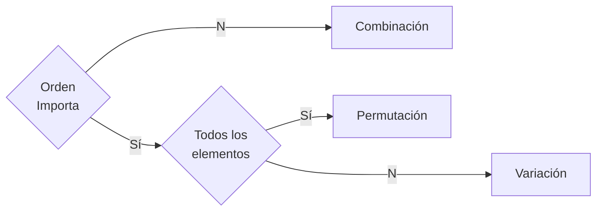

# Probabilidad y estadística (2do parcial)

## Probabilidad

### Reglas

#### Suma (o)

$$
\begin{align}
	P(A \cup B) &= P(A) + P(B) - P(A \cap B) \tag{No Excluyente}\\
	P(A \cup B) &= P(A) + P(B) \tag{Excluyentes}
\end{align}
$$

#### Multiplicación (y)

$$
\begin{align}
	P(A \cap B) &= P(A) \cdot P(B|A) = P(B) \cdot P(A|B) \tag{Dependiente}\\
	P(A \cap B) &= P(A) \cdot P(B) \tag{Independiente}
\end{align}
$$

### Tipos de Eventos

- **Simples o elemental:** Cada uno de los posibles resultados de un
  **experimento aleatorio**
- **Compuestos:** cuando los posibles resultados son varios.
- **Mutuamente excluyente:** Cuando no pueden ocurrir simultaneamente
- **Independientes:** No tienen que ver con otro evento
- **Dependientes:** Un evento afecta directamente al otro evento; **probadilidad
  condicional**

$$P(A) = \cfrac{\text{\# de veces que se obtuvo el resultado}}{\text{\# de veces que se realiza el experimento}} \tag{Empírica o Frecuencial}$$

### Experimentos

**Aleatorio:** No se sabe el resultado con anticipación **Deterministico:** Se
sabe el resultado con anticipación

## Modelos probabilisticos de distribución

$$
\begin{align}
	p &= \frac{k}{n}\\
	q &= 1-p\\
\end{align}
$$

### Distribuciones

$$
\begin{align}
	P(x) &= \frac{1}{N} \tag{Uniforme Discreta}\\
	P(x) &= p^x \cdot (q)^{1 - x} &x = 0.1 \tag{Bernoulli}\\
	P(x) &= \binom{n}{x} \cdot p^x \cdot (q)^{n - x} \tag{Binomial}\\
	P(x) &= (q)^{k-1} \cdot p \tag{Geométrica}\\
	P(x) &= \frac{\binom Ax \binom{N-A}{n-x}}{\binom Nn} \tag{Hipergeométrica}\\
	P(x) &= \frac{e^{-\lambda} \lambda^x}{x!} & \lambda > 0 \tag{Poisson}\\
	P(x) &= \lambda e^{-\lambda x} \tag{Exponencial}
\end{align}
$$

#### Distribución binomial

$$
\begin{align}
	\mu &= np & \tag{Media}\\
	\sigma² &= npq \tag{Varianza}\\
	\sigma &= \sqrt{npq}\tag{Desviación Estándar o Típica}
\end{align}
$$

#### Distribución normal estándar

> [!info] Propiedades
>
> - $\overline{x}, \tilde{x}, \hat{x}$ coinciden
> - Puntos de inflexión: -1 y 1
> - **Regla empírica**
>   - 68 % de los datos están entre -1 y 1 $\sigma$
>   - 95 % de los datos están entre -2 y 2 $\sigma$
>   - 99.7 % de los datos están entre -3 y 3 $\sigma$
> - La **distribución** es **simetrica** alrededor de $\mu$
> - $x$ con $N(\mu, \sigma)$

> [!Note]
>
> - Se requiere consultar las **tablas de distribución** para $P(z < z_1)$
> - Para $P(z = z_1)$ se utiliza la fórmula para **rangos**, pero con un rango
>   muy cercano a $z$
> - Para poder utilizar la tabla tenemos que transformar la variable $x$ que
>   sigue una distribución $N(0, 1)$ en otra variable $z$ que siga una
>   distribución $N(0, 1)$. Para ello utilizar la _fórmula de**normalicación**_

$$
\begin{align}
	z &= \cfrac{x - μ}{σ} \tag{Tipificación o Normalización}\\
	P(z_1 < z < z_2) &= P(z < z_2) - P(z < z_1) \tag{Rango}\\
	P(z \geq z_1) &= 1 - P(z <z_1)
\end{align}
$$

## Técnicas de Conteo

> [!NOTE]
>
> - Eventos siempre se escriben con mayúsculas
> - Población: $n$
> - Muestra o agrupaciones: $r$

- **Experimento aleatorio:** Aquel en el que _no es posible repetir resultado_
- **Espacio muestral:** Conjunto de _resultados posibles_ de un **experimento
  aleatorio** $S$ o $\Omega$
- **Evento o suceso:** Conjunto de resultados del **experimento aleatorio**
  (delimitación del conjunto).

> [!NOTE]
>
> Algunos autores no subdividen la **permutación** en **permutación** y
> **variación**.

> [!NOTE]
>
> Una _calculadora científica_ maneja las funciones de _**combinación** y la
> **permutación** (o variación) **sin remplazo**_

### Combinaciones

$$
\begin{align}
	nCr &= \frac{n!}{r!(n-r)!} \tag{Sin remplazo}\\
	nC_Rr &= \frac{(n + r - 1)!}{r!(n-1)!} \tag{Con remplazo}
\end{align}
$$

### Permutaciones

$$
\begin{align}
	nPr &= n! \tag{Lineal}\\
	P_c &= (n-1)! \tag{Circular}\\
	P_R &= \frac{n!}{k_1! k_2! \cdots k_n!} \tag{Repetición}\\
\end{align}
$$

### Varianza

$$
\begin{align}
	nV_R &= \frac{n!}{(n-r)!}\tag{Sin Repetición}\\
	nV_Rr &= n^r \tag{Repetición}\\
\end{align}
$$

## Referencias

- ProbabilidadyEstadistica.net. (s.f.). _Evento simple (o suceso elemental)_.
  https://www.probabilidadyestadistica.net/evento-simple-suceso-elemental/

- Marta (s.f.). _La distribución normal estándar - concepto y normalización_.
  https://www.superprof.es/apuntes/escolar/matematicas/probabilidades/distribucion-normal/distribucion-normal-estandar.html

- Marta (s.f.). _Media, desviación típica y varianza de la distribución
  binomial_.
  https://www.superprof.es/apuntes/escolar/matematicas/probabilidades/distribucion-binomial/media-y-varianza-de-la-distribucion-binomial.html

- Matemáticas profe Alex. (2020). _Diferenciar entre combinación, permutación o
  variación | Ejemplo 1_ . Recuperado el 28 de octubre de 2023 de
  https://www.youtube.com/watch?v=dRN15Or4o00&list=PLeySRPnY35dFF_kWyWL893posL7DNlFHa&index=7

- Matemáticas profe Alex. (2023). _Combinaciones, permutaciones y variaciones |
  Ejemplo 1_ . Recuperado el 28 de octubre de 2023 de
  https://www.youtube.com/watch?v=h4IfRXoVcpo&list=PLeySRPnY35dFF_kWyWL893posL7DNlFHa&index=9

- Matemáticas profe Alex. (2023). _Permutación explicación completa | Lineal,
  Circular y con elementos repetidos_. Recuperado el 28 de octubre de 2023 de
  https://www.youtube.com/watch?v=iczs93s3k1I&list=PLeySRPnY35dFF_kWyWL893posL7DNlFHa&index=12

- Matemáticas profe Alex. (2023). _Variación Con repetición y Sin repetición |
  Ejemplo 1_ . Recuperado el 28 de octubre de 2023 de
  https://www.youtube.com/watch?v=IbriKkbgXNU&list=PLeySRPnY35dFF_kWyWL893posL7DNlFHa&index=15
