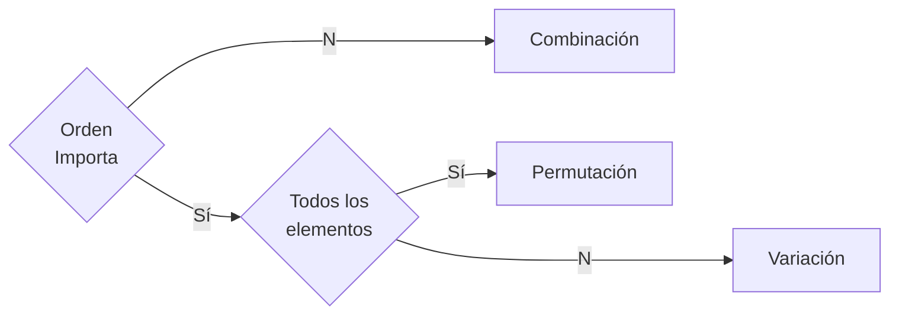

# Probabilidad y estadística (2do parcial)

## Probabilidad

### Regla de la suma (o)

$$\begin{align}
P(A \cup B) &= P(A) + P(B) - P(A \cap B) \tag{No Excluyente} \\
P(A \cup B) &= P(A) + P(B) \tag{Excluyentes}
\end{align}$$

### Regla de la multiplicación (y)

$$\begin{align}
P(A \cap B) &= P(A) \cdot P(B|A) = P(B) \cdot P(A|B) \tag{Dependiente} \\
P(A \cap B) &= P(A) \cdot P(B) \tag{Independiente}
\end{align}$$

## Modelos probabilisticos de distribución

$$\begin{align}
	p &= \cfrac{k}{n} \\
	\mu &= np & \tag{Media} \\
	\sigma² &= \sqrt{npq \cdot \cfrac{Nn}{N-1}} \tag{Varianza}
\end{align}$$

### Distribuciones

$$\begin{align}
	P(x) &= \cfrac{1}{N} \tag{Uniforme Discreta}\\
	P(x) &= p^x \cdot (1 - p)^{1 - x} &x = 0.1 \tag{Bernoulli}\\
	P(x) &= \binom{n}{x} \cdot p^x \cdot (1 - p)^{n - x} \tag{Binomial} \\
	P(x) &= (1 - p)^{k-1} \cdot p \tag{Geométrica}\\
	P(x) &= \cfrac{\binom Ax \binom{N-A}{n-x}}{\binom Nn} \tag{Hipergeométrica} \\
	P(x) &= \cfrac{e^{-\lambda} \lambda^x}{x!} & \lambda > 0 \tag{Poisson} \\
	P(x) &= \lambda e^{-\lambda x} \tag{Exponencial}
\end{align}$$

## Técnicas de Conteo

> [!NOTE]
> 
> Eventos siempre se escriben con mayúsculas

> [!NOTE]
> 
> - Población: $n$
> - Muestra o agrupaciones: $r$

- **Experimento aleatorio:** Aquel en el que _no es posible repetir resultado_
- **Espacio muestral:** Conjunto de _resultados posibles_ de un **experimento aleatorio** $S$ o $\Omega$ 
- **Evento o suceso:** Conjunto de resultados del **experimento aleatorio** (delimitación del conjunto).

> [!NOTE]
> 
> Algunos autores no subdividen la **permutación** en **permutación** y **variación**.

> [!NOTE]
> 
> Una _calculadora científica_ maneja las funciones de _**combinación** y la **permutación** (o variación) **sin remplazo**_ 

### Combinaciones

$$\begin{align}
nCr &= \cfrac{n!}{r!(n-r)!} \tag{Sin remplazo} \\
nC_Rr &= \cfrac{(n + r - 1)!}{r!(n-1)!} \tag{Con remplazo}
\end{align}$$

### Permutaciones

$$\begin{align}
	nPr &= n! \tag{Lineal}\\
	P_c &= (n-1)! \tag{Circular}\\
	P_R &= \cfrac{n!}{k_1! k_2! \cdots k_n!} \tag{Repetición}\\
\end{align}$$

### Varianza

$$\begin{align}
	nV_R &= \cfrac{n!}{(n-r)!}\tag{Sin Repetición} \\
	nV_Rr &= n^r \tag{Repetición}\\
\end{align}$$

## Referencias 

- Matemáticas profe Alex. (2020). _Diferenciar entre combinación, permutación o variación | Ejemplo 1_ . Recuperado el 28 de octubre de 2023 de https://www.youtube.com/watch?v=dRN15Or4o00&list=PLeySRPnY35dFF_kWyWL893posL7DNlFHa&index=7

- Matemáticas profe Alex. (2023). _Combinaciones, permutaciones y variaciones | Ejemplo 1_ . Recuperado el 28 de octubre de 2023 de https://www.youtube.com/watch?v=h4IfRXoVcpo&list=PLeySRPnY35dFF_kWyWL893posL7DNlFHa&index=9

- Matemáticas profe Alex. (2023). _Permutación explicación completa | Lineal, Circular y con elementos repetidos_. Recuperado el 28 de octubre de 2023 de https://www.youtube.com/watch?v=iczs93s3k1I&list=PLeySRPnY35dFF_kWyWL893posL7DNlFHa&index=12

- Matemáticas profe Alex. (2023). _Variación Con repetición y Sin repetición | Ejemplo 1_ . Recuperado el 28 de octubre de 2023 de https://www.youtube.com/watch?v=IbriKkbgXNU&list=PLeySRPnY35dFF_kWyWL893posL7DNlFHa&index=15
